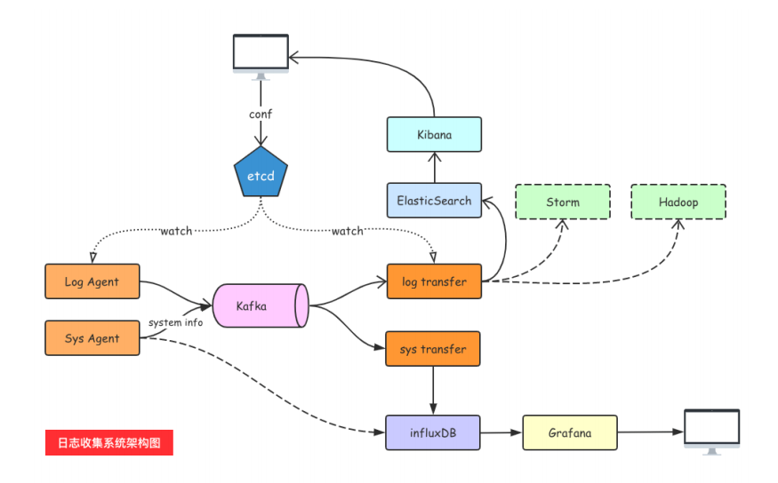

[toc]

# 1. 总述

##  1. 1 用到的技术栈

| ETCD          | 服务发现和注册， 主要用户配置的下发，logagent主动注册。watch 监听日志目录的变化，更新agent的tail 的文件， |      |
| ------------- | ------------------------------------------------------------ | ---- |
| Kafka         | 主要用户日志消息队列，日志消息是大数据，消息队列缓冲消息持久化ES的压力 |      |
| elasticsearch | 承载了数据存储和查询的功能                                   |      |
| Kibana        | 前端调接口提供可配置的可视化                                 |      |



## 1.2 启动方式

```ini
[etcd]
; etcd 集群地址
endpoints = 192.168.1.5:12381,192.168.1.5:12382,192.168.1.5:12381
dialTimeout = 5000

[es]
endpoints = http://192.168.1.102:9200
dialTimeout = 5000
chanSize=100000
nums=16

[kafka]
endpoints = 192.168.1.5:9092
; chan 大小
chanMsgSize = 100000

[log]
dir = ./logs
file.name = ${app.name}
;文件最大保存时间
max.age = 7d
;日志切割时间间隔
rotation.time = 24h
level = debug
enableLineLog = true
```

## 1.3 build

```sh
go build  gitee.com/lwx0416/logAgent/brun
nohup ./brun 2&>1 & 
```

# 2. 具体实现

1. log 日志的收集， 配置日志路径（需要前端界面）
2. 发送Kafka, 并且从kafka消费到ES数据库
3. 配置界面的接口开发


## 2.1 loganget 收集实现

servers/tail.go

```go
func NewTailJob(path string, topic string) (tailJob *TailJobMgr) {
    // 上下文管理， 在日志配置变更时候关闭日志收集协程， 重新监听新的文件
	ctx, cancel := context.WithCancel(context.TODO())
	tailJob = &TailJobMgr{
		path:       path,
		topic:      topic,
		ctx:        ctx,
		cancelFunc: cancel,
	}
    // 打开文件， 发送日志到chan中，有具体的消费协程消费到kafka
	if err := tailJob.Init(); err != nil {
		logrus.Error("打开文件失败： ", err)
         return
	}
	
	return
}
```


## 2.2  服务注册实现

```go
func (l *LogEntry) WatchTailJob() (err error) {
	var (
		logEntryList []*LogEntry
		log          *LogEntry
		jobEvent     *JobEvent
	)
	client := base.EtcdClient()
	jobWatch := clientv3.NewWatcher(client)
	logAgnetKey, err := GetLocalIP()
	if err != nil {
		logrus.Error(err)
		panic("获取本机ip失败")
	}
	jobKey := JOB_SAVE_DIR + logAgnetKey + "/"
	getResp, err := client.Get(context.TODO(), jobKey, clientv3.WithPrefix())
	if err != nil {
		logrus.Error("从ETCD获取logpath 失败： ", err)
		return
	}
	for _, v := range getResp.Kvs {
		var logEntry *LogEntry
		err = json.Unmarshal(v.Value, &logEntry)
		if err != nil {
			logrus.Error("获取log path 值失败：", err)
			return
		}
		logEntry.logName = string(v.Key)
		logEntryList = append(logEntryList, logEntry)
	}
	logrus.Debug(logEntryList)
	// 初始化任务一次
	for _, v := range logEntryList {
		jobEvent := BuildJobEvent(JOB_EVENT_SAVE, v)
		GScheduler.PushJobEvent(jobEvent)

	}

	// 从当前revision 版本向后监听
	go func() {
		watchStartRevision := getResp.Header.Revision
		watchChan := jobWatch.Watch(context.TODO(), jobKey, clientv3.WithRev(watchStartRevision), clientv3.WithPrefix())
		// 处理监听事件
		for watchResp := range watchChan {
			for _, watchEvent := range watchResp.Events {
				switch watchEvent.Type {
				case mvccpb.PUT:
					// 1. 分为添加和修改
					if log, err = UnpackJob(watchEvent.Kv.Value); err != nil {
						continue
					}
					// 2. 构建event
					jobEvent = BuildJobEvent(JOB_EVENT_SAVE, log)
				case mvccpb.DELETE:
					// 删除
					logName := ExtractJobName(string(watchEvent.Kv.Key))
					log := &LogEntry{logName: logName}
					jobEvent = BuildJobEvent(JOB_EVENT_DELETE, log)
				}
				logrus.Infof("监听事件变化: \t %d , %+v, %+v", jobEvent.EventType, jobEvent.Job)
				fmt.Println("key： ", watchEvent.Kv.Key)
                 // 发送任务, 有协程消费具体任务
				GScheduler.PushJobEvent(jobEvent)
			}
		}
	}()
	return
}

```

## 2.3 Scheduler 模块设计


```go
type Scheduler struct {
	logEntry          []*LogEntry  // 任务具体信息
	jobExecutingTable map[string]*TailJobMgr // 正在执行的任务表, 监听etcd配置变化,动态更新
	jobEventChan      chan *JobEvent  // 任务队列, 修改任务,删除任务
}

// 当etcd配置变动, push chan里面
func (s *Scheduler) PushJobEvent(jobEvent *JobEvent){...}
// 调度协程
func (s *Scheduler) ScheduleLoop() {...}
// 处理任务模块， 主要监听jobEventChan 任务事件
func (s *Scheduler) HandleJobEvent(jobEvent *JobEvent){...}
```

## 2.4 Kafka主要是消息生产和消费

1. 生产任务
2. 消费消息

## 2.5 ES 持久化

```go
func InitEs(nums int) {
   // 读取配置文件
   conf := base.Props()
   chanSize := conf.GetIntDefault("es.chanSize", 1000000)
   fmt.Println("初始化ES, chanSize", chanSize)
   //chanSize := 100000
   esMsgChan = make(chan *EsLogData, chanSize)
   // 多协程写入ES
   for i := 0; i < nums; i++ {
      go sendToES()
   }
}
```

